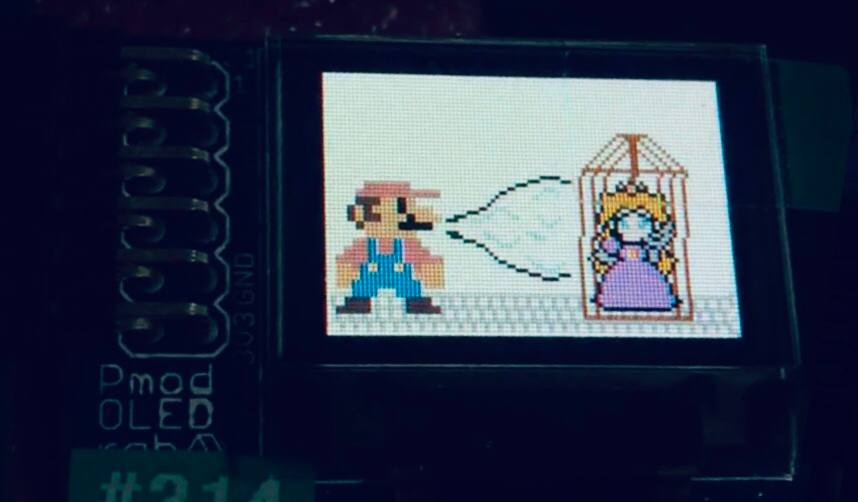

# Into-the-NintendoVerse

Into the NintendoVerse is a nintendo based gaming marathon. Complete each challenge before finally helping mario save princess peach!\
Into the NintendoVerse is a FPGA project based on a Basys 3 Development Board. Use varying audio levels to control your character and clear the stages.\
Here's a video to check out if you are interested! [Video of game in action(instant clear)](https://drive.google.com/drive/folders/1jL09lI_x_Bof9BM-Bzr6XZj4Xl0nAJg9?usp=sharing)
